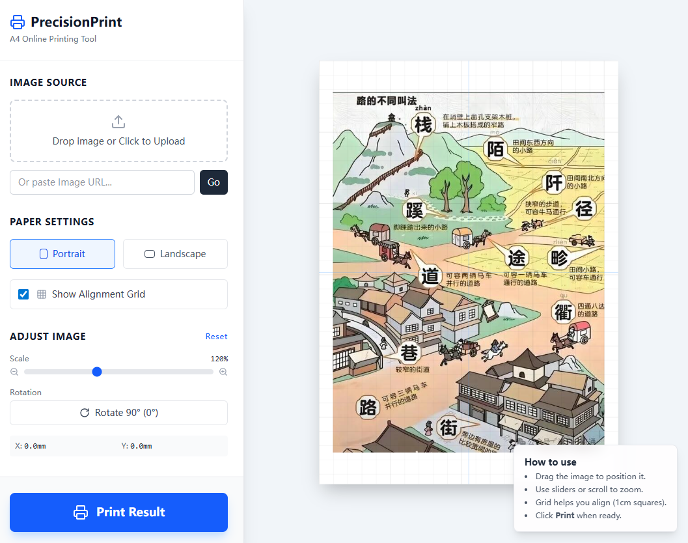

# PrecisionPrint A4 (在线精准打印工具)

**PrecisionPrint A4** 是一个基于 React 的轻量级在线工具，旨在解决日常打印图片时“尺寸无法控制”和“自动裁剪”的痛点。

它允许用户在一个标准的 A4 画布上，**精确控制图片的打印尺寸、缩放比例和具体位置**，所见即所得。



## 核心亮点：为什么使用这个工具？

系统自带的打印功能通常只有 "适应页面 (Fit to Page)" 或 "填满页面 (Fill Page)" 两种选择，这导致：
1. 图片被强制拉伸，比例失调。
2. 图片边缘被自动裁剪，丢失内容。
3. 无法打印特定尺寸（例如：在一张 A4 纸上只打印一个 5cm 宽的 Logo）。

**PrecisionPrint A4 解决了这些问题：**

*   **📏 精确的尺寸控制 (Size Control)**：
    *   告别模糊的“大中小”选项。
    *   通过**缩放滑块 (Scale)**，你可以将图片调整为原来的 50%、100% 甚至 200%。
    *   无论是打印一张 2寸证件照、一张 10cm x 15cm 的照片，还是全页海报，你都可以通过视觉反馈精确调整大小。

*   **🎯 自由布局 (Free Positioning)**：
    *   支持**拖拽 (Drag & Drop)**。想把图片打印在纸张的右上角？或者正中心？只需用鼠标拖动即可。
    *   配合**辅助网格 (Grid)**，你可以轻松对齐图片。

## 功能特性

*   **多种导入方式**：支持本地上传图片或输入图片 URL。
*   **A4 标准画布**：严格按照 A4 纸张尺寸 (210mm x 297mm) 渲染，确保打印结果与屏幕预览一致。
*   **方向切换**：一键切换横向 (Landscape) 或纵向 (Portrait) 排版。
*   **辅助对齐**：
    *   提供 1cm x 1cm 的标准网格背景。
    *   提供中心十字参考线。
*   **旋转调整**：支持 90 度旋转图片。
*   **纯净打印**：点击打印时，自动生成无 UI干扰的高清打印页面，直接调用系统打印机。

## 快速开始 (本地运行)

本项目使用 Vite + React + TypeScript 构建。

### 1. 安装依赖
```bash
npm install
```

### 2. 启动开发服务器
```bash
npm run dev
```

### 3. 使用方法
1. 打开浏览器访问 `http://localhost:5173`。
2. 点击左侧 "Drop image" 上传图片。
3. **调整大小**：拖动 Scale 滑块，改变图片在 A4 纸上的实际占用面积。
4. **调整位置**：直接在右侧画布上拖动图片。
5. 点击 "Print Result" 按钮，弹出打印窗口并进行打印。

## 技术栈

*   **React 19**
*   **TypeScript**
*   **Tailwind CSS** (用于 UI 样式)
*   **Lucide React** (图标库)

## 常见问题

**Q: 打印出来的大小准确吗？**
A: 本工具在 CSS 中使用 `mm` (毫米) 作为单位进行渲染。只要打印机设置中选择 "实际大小 (Actual Size)" 或 "缩放 100%"，而不选择 "适应页面"，打印出的尺寸将非常接近屏幕上设定的物理尺寸。

**Q: 为什么点击打印没有反应？**
A: 为了绕过某些浏览器的安全沙箱限制，打印功能会打开一个新的弹窗。请检查浏览器地址栏，确保允许本站点显示**弹出窗口 (Popups)**。
